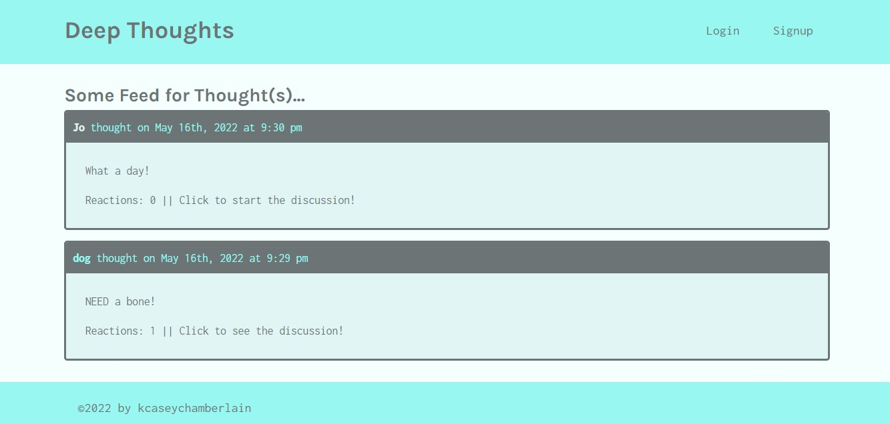

#Deep Thoughts

### Description
This full stack M.E.R.N. application is a forum where the user can securely and dynamically login to their account to view thoughts and reactions of other users.

### License

This application is licensed under MIT

### Application Demo

### Table of Contents
- [Description](#description)
- [Contributing](#contributing)
- [Tests](#tests)
- [Questions?](#questions)

### Contributing
No contributions at this time.

### Tests
N/A

### Questions
GitHub Username: (kcaseychamberlain) 

View the project in GitHub at: https://github.com/KCaseyChamberlain/deep-thoughts

View the application live hosted at: https://guarded-wave-66695.herokuapp.com/
    
If you have any questions, contact Casey at: caseygchamberlain@gmail.com

